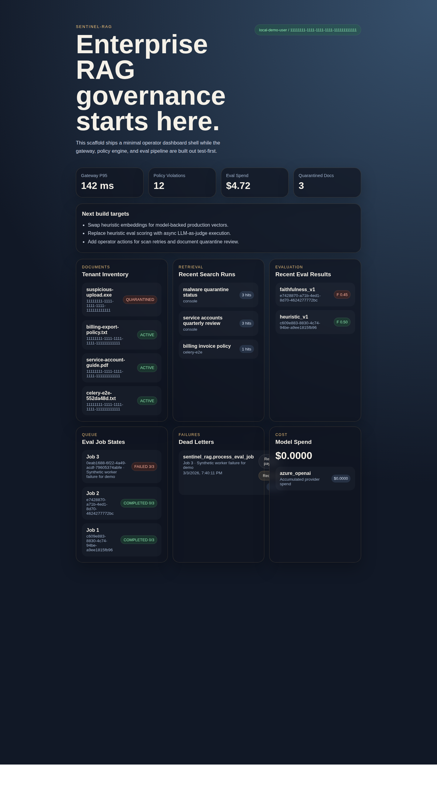
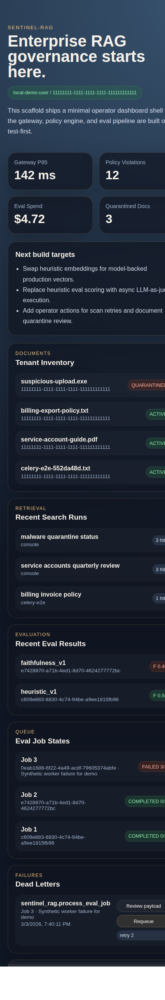
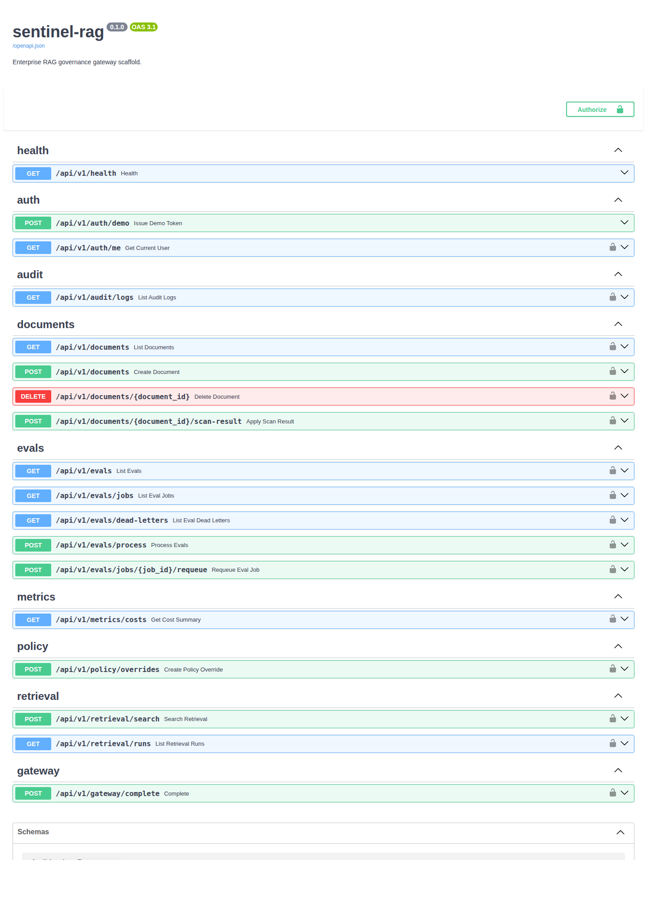

# sentinel-rag

`sentinel-rag` is a multi-tenant RAG governance gateway for enterprise AI applications.

It sits between clients and LLM providers, applying policy controls before inference, running hybrid retrieval over tenant documents, persisting an auditable trail of model activity, and executing asynchronous evaluation jobs through a resilient worker pipeline.

## What It Demonstrates

- FastAPI backend with route-level dependency injection and test-first service boundaries
- React dashboard for documents, retrieval runs, eval results, job state, dead letters, and spend
- Gateway routing with provider abstraction, fallback ordering, and circuit-breaker behavior
- Prompt policy enforcement for prompt injection blocking and PII redaction
- Hybrid retrieval using persisted chunk metadata with native Postgres `pgvector` + keyword search
- Audit logging with prompt hashing, redaction, encryption at rest, and response-body TTL retention
- Async eval job orchestration with Celery, retries, requeue, and dead-letter capture
- Tenant quota controls for evaluation spend and monthly LLM budget enforcement

## Current Status

This repository is a serious working prototype, not a finished production deployment.

What is real today:

- Persistence model for documents, retrieval, audit logs, model invocations, eval jobs, and quotas
- Local infra for Postgres and Redis
- API-backed operator flows for audit, eval queue state, dead letters, and requeue
- Test coverage across the main backend slices

What is intentionally still incomplete:

- Embeddings are still local heuristic vectors, not model-backed production embeddings
- The eval judge still uses a local deterministic simulation behind a prompt-based interface
- Live provider mode exists, but safe local development defaults to stubbed completions unless credentials are configured
- OpenTelemetry instrumentation is not wired yet

## Repository Layout

- `backend/` FastAPI app, core services, Celery tasks, tests, and Alembic baseline
- `frontend/` React dashboard
- `infra/` local Docker Compose for Postgres and Redis
- `docs/` consolidated spec and implementation checklist
- `memory/` daily implementation notes

## Key Docs

- `docs/sentinel-rag-spec-v2-consolidated.md`
- `docs/implementation-checklist.md`

The original `.docx` blueprint and addendum are also kept in the repository as source material.

## Screenshots

### Live Dashboard (Desktop)



### Live Dashboard (Mobile)



### Backend API Docs



## Local Development

### Backend

```bash
cd backend
../.venv/bin/python -m uvicorn main:app --reload
```

### Frontend

```bash
cd frontend
npm run dev
```

### Tests

```bash
cd backend
../.venv/bin/python -m pytest tests -q
```

### Local Infrastructure

```bash
docker compose -f infra/docker-compose.yml up -d
```

The default local mode is intentionally safe:

- `GATEWAY_PROVIDER_MODE=stub`
- `AUTH_VERIFIER_MODE=local`

That means you can run the project without live Azure/OpenAI/Anthropic credentials until you explicitly opt in.

## Interview Framing

This project is well suited for backend and systems-design discussions:

- multi-tenant service boundaries
- governance and policy enforcement around LLM usage
- async worker reliability patterns
- persistence and auditability tradeoffs
- progressive hardening of an AI platform prototype

It is best presented honestly as a tested, evolving platform slice with clear production extension points rather than as a fully finished enterprise product.
